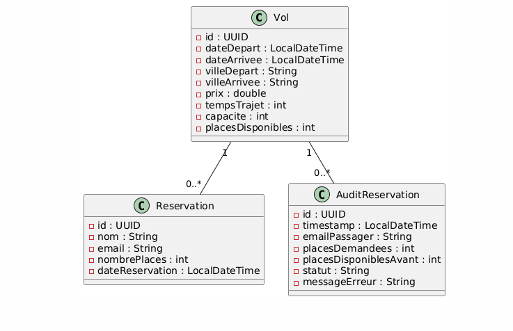

# ✈️ Flight Reservation App

Projet technique de démonstration : gestion et réservation de vols avec **Spring Boot (backend)**, **Angular 18 (frontend)** et **SQLite**.

---

## 🚀 Fonctionnalités

### Backend (Spring Boot)
- CRUD de vols (`GET /api/vols`, `POST /api/vols`)
- Recherche filtrée par ville, date, tri par prix ou durée
- Réservation de places (`POST /api/reservations`)
- Cohérence transactionnelle :
  - Vérification des places disponibles
  - Verrouillage optimiste ✅  
    (J’ai choisi le **verrouillage optimiste**, car il est plus rapide et adapté à mon application de réservation où les conflits simultanés sont rares.  
    Le **verrouillage pessimiste** aurait pu être utilisé, mais il bloque la base de données et ralentit en cas de nombreuses réservations simultanées.)
  - Gestion des conflits de concurrence (409)
- Audit des réservations (`GET /api/reservations/audit`)
- Cache des places disponibles avec invalidation automatique
- Validation des entrées + gestion d’erreurs centralisée

### Frontend (Angular 18 + Nx)
- Formulaire de recherche de vols
- Sélecteur de dates réutilisable (librairie `shared/calendar`)
- Liste paginée des vols
- Design responsive moderne (SCSS)

---

## 📦 Prérequis

- **Java 17+**
- **Maven 3.9+**
- **Node.js 20+** + **npm** ou **yarn**
- **Angular CLI 18**
- **SQLite** (aucune config serveur nécessaire)

---

## 🛠️ Installation & Exécution

### 1. Cloner le repo
```bash

git clone https://github.com/alagtg/projet-angular-springboot.git
cd projet-angular-springboot


2. Backend (Spring Boot)

cd demo
mvn clean install
mvn spring-boot:run
👉 API accessible sur http://localhost:8080/api/vols


3. Frontend (Angular 18 + Nx)

cd flight-workspace/flight-app
npm install
nx serve flight-app
👉 UI accessible sur http://localhost:4200


Un fichier trajets.json
 est fourni à la racine du projet.
Il contient des exemples de vols pour tester facilement l’API

## 📊 Diagramme UML


